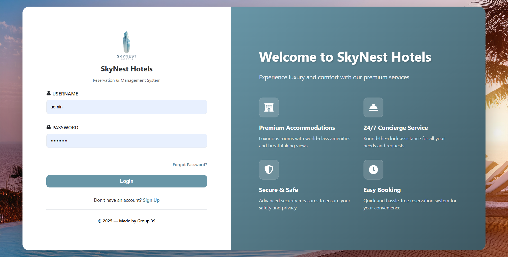
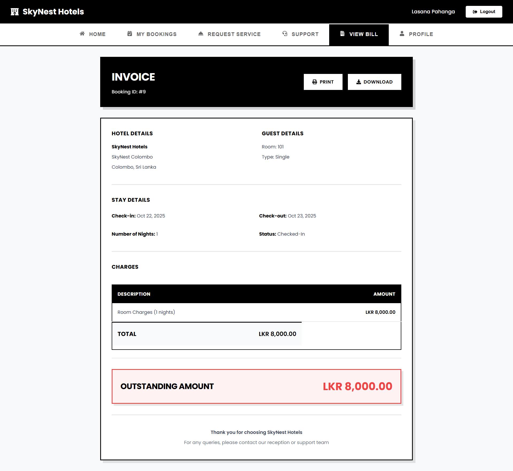
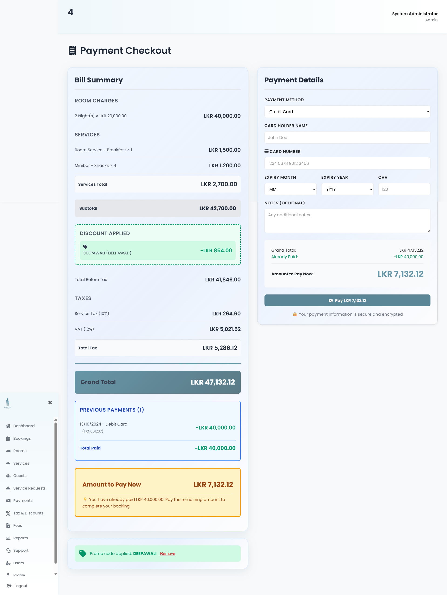

# 🏨 Hotel SkyNest Management System

<div align="center">



**A comprehensive hotel management system built with React (Vite), Node.js, Express, and MySQL**

[](https://reactjs.org/)
[](https://nodejs.org/)
[](https://www.mysql.com/)
[](LICENSE)

[Features](#-features) • [Screenshots](#-screenshots) • [Installation](#-installation) • [API Docs](#-api-documentation) • [Contributing](#-contributing)

</div>

---

## 🌟 Key Highlights

- 🎯 **Role-Based Access Control** - Separate dashboards for Admin, Receptionist, and Guest users
- 💰 **Advanced Financial System** - Comprehensive tax, discount, and fee management
- 📊 **Real-Time Billing** - Live bill calculation with automatic updates
- 🛎️ **Service Management** - Complete service request and tracking system
- 📈 **Detailed Reporting** - Revenue, occupancy, and service analytics
- 🔐 **Secure Authentication** - JWT-based auth with email verification
- 🐳 **Docker Ready** - Easy deployment with Docker and Docker Compose
- ☁️ **Cloud Deployable** - Railway deployment configuration included

## Docker Setup
Go to root folder sky-nests:

```bash
docker build -t skynest-frontend -f Dockerfile.frontend .
docker build -t skynest-backend -f Dockerfile.backend .
docker-compose up -d
```

Frontend Interface: Open your browser and navigate to http://localhost
This should display your React-based frontend application.

Backend API: Access your API at http://localhost:5000
You can test endpoints like http://localhost:5000/api/health to verify it's working.

## Railway Deployment

To deploy on Railway:

1. **Connect your GitHub repository to Railway**
   - Go to [railway.app](https://railway.app/)
   - Sign up or log in
   - Click "New Project" → "Deploy from GitHub repo"
   - Select your Hotel-SkyNest repository

2. **Add a MySQL database service**
   - In your Railway project, click "New Service"
   - Select "Database" → "MySQL"
   - Railway will automatically create and connect the database

3. **Set environment variables**
   - Click on your service
   - Go to the "Variables" tab
   - Add the following variables:
     - `JWT_SECRET`: A secure random string (e.g., generate one at random.org)
     - `NODE_ENV`: `production`
   
   Note: Database variables (DB_HOST, DB_USER, DB_PASSWORD, DB_NAME, DB_PORT) will be automatically set by Railway when you add the MySQL service.

4. **Deploy**
   - Railway will automatically build and deploy your application
   - Once deployed, you'll get a URL to access your application

5. **Initialize the database** (Optional)
   - Connect to your Railway MySQL instance using the connection details
   - Run the SQL scripts from the `database` folder to set up your schema and seed data

## 🚀 Quick Start

Get Hotel SkyNest running in 5 minutes:

```bash
# 1. Clone the repository
git clone https://github.com/yourusername/Hotel-SkyNest.git
cd Hotel-SkyNest

# 2. Setup database
mysql -u root -p
CREATE DATABASE skynest_hotels;
exit
mysql -u root -p skynest_hotels < database/COMPLETE_DATABASE_SETUP.sql

# 3. Setup backend
cd backend
npm install
cp .env.example .env
# Edit .env with your database credentials
npm start

# 4. Setup frontend (in new terminal)
cd frontend
npm install
npm run dev

# 5. Access the application
# Frontend: http://localhost:5173
# Backend: http://localhost:5000
# Login with: admin@skynest.com / admin123
```

## 📋 Table of Contents

- [Key Highlights](#-key-highlights)
- [Quick Start](#-quick-start)
- [Features](#-features)
  - [Role-Based Dashboards](#-role-based-dashboards)
  - [Booking System](#-booking-system)
  - [Payment & Financial System](#-advanced-payment--financial-system)
  - [Service Management](#️-service-management)
  - [Reporting](#-comprehensive-reporting)
  - [Support System](#-support-system)
  - [Security & Authentication](#-security--authentication)
- [Screenshots](#-screenshots)
- [Tech Stack](#️-tech-stack)
- [System Architecture](#️-system-architecture)
- [Database Schema](#️-database-schema)
- [Payment & Financial System](#-payment--financial-system)
- [Installation](#-installation)
  - [Docker Setup](#docker-setup)
  - [Railway Deployment](#railway-deployment)
  - [Local Development](#local-development-setup)
- [API Documentation](#-api-documentation)
- [Database Procedures](#-database-procedures)
- [Usage Examples](#-usage-examples)
- [Contributing](#-contributing)
- [Support](#-support)
- [License](#-license)

## ✨ Features

### 🎯 Role-Based Dashboards

#### Admin Dashboard


**Admin Capabilities:**
- 👥 **User Management** - Create, edit, and manage users (Admin, Receptionist, Guest roles)
- 🏢 **Branch Management** - Add and configure multiple hotel branches
- 🛏️ **Room Management** - Define room types, add rooms, set pricing, and manage availability
- 📊 **Financial Configuration**:
  - Tax Management (VAT, Service Tax, custom taxes)
  - Discount Configuration (percentage, fixed, early bird, loyalty, seasonal)
  - Fee Management (late checkout, early checkin, cancellation, damage fees)
- 📈 **Advanced Reports**:
  - Revenue reports (system-wide and branch-specific)
  - Room occupancy analytics
  - Service trends and popularity
  - Unpaid bookings tracking
  - Guest history reports
- 🛎️ **Service Catalogue** - Manage available services and branch-specific offerings
- 🎫 **Support Ticket Management** - View and respond to all guest tickets
- 📉 **Audit Logs** - Complete system activity tracking

#### Receptionist Dashboard


**Receptionist Capabilities:**
- 📅 **Booking Management**:
  - Create new bookings with availability checking
  - View and manage all bookings
  - Check-in and check-out guests
  - Modify booking details
  - Cancel bookings with refund calculation
- 👤 **Guest Management**:
  - Register new guests
  - View guest profiles and history
  - Update guest information
- 💰 **Payment Processing**:
  - Process payments (cash, card, bank transfer, online)
  - View payment history
  - Generate receipts
  - Track outstanding balances
- 🛎️ **Service Requests**:
  - View and manage service requests
  - Add service usage to bookings
  - Track service fulfillment
- 📊 **Live Bill Calculation** - Real-time billing with taxes, discounts, and fees
- 🎫 **Support Tickets** - Create and respond to guest support requests

#### Guest Dashboard


**Guest Capabilities:**
- 📅 **My Bookings** - View current and past reservations
- 💳 **Payment History** - Track all payments and receipts
- 🛎️ **Service Requests** - Request room service, housekeeping, maintenance, etc.
- 🎫 **Support Tickets** - Create and track support requests
- 👤 **Profile Management** - Update personal information
- 🧾 **Live Bill View** - Check current charges during stay



### 📅 Booking System


**Booking Features:**
- ✅ **Real-time Availability Checking** - Instant room availability validation
- 📆 **Date Range Selection** - Flexible check-in/check-out dates
- 🛏️ **Room Type Selection** - Choose from available room categories
- 👥 **Guest Information** - Capture guest details and special requests
- 💰 **Automatic Pricing** - Calculate total based on nights and room rate
- 🎟️ **Discount Application** - Apply eligible discounts automatically
- 📧 **Booking Confirmation** - Email notifications for bookings
- 🔄 **Booking Status Tracking** - Pending, Confirmed, Checked-in, Checked-out, Cancelled
- ⏰ **Check-in/Check-out Management** - Process arrivals and departures
- 📊 **Booking History** - Complete booking records with filters

### 💰 Advanced Payment & Financial System

**Payment Processing:**
- 💳 **Multiple Payment Methods**:
  - Cash
  - Credit Card
  - Debit Card
  - Bank Transfer
  - Online Payment Gateway
- 📊 **Payment Breakdown** - Detailed itemization of all charges
- 🧾 **Receipt Generation** - Automatic receipt creation with PDF export
- 💵 **Partial Payments** - Support for advance payments and balance settlements
- 📈 **Payment History** - Complete transaction tracking
- 🔄 **Refund Processing** - Automated refund calculations for cancellations

**Tax Management:**
- 🧮 **Flexible Tax Configuration** - Define custom taxes per branch
- 📊 **Multiple Tax Types**:
  - VAT (Value Added Tax) - Applied to total booking
  - Service Tax - Applied to service charges
  - Custom taxes with configurable rates
- 🔄 **Automatic Tax Calculation** - Real-time tax computation
- 📈 **Tax Reports** - Track tax collected by type and period

**Discount System:**
- 🎟️ **Discount Types**:
  - Percentage Discounts (e.g., 15% off)
  - Fixed Amount Discounts (e.g., ₹500 off)
  - Early Bird Discounts (book X days in advance)
  - Loyalty Discounts (repeat customer benefits)
  - Seasonal Discounts (holiday/off-season rates)
- ✅ **Validation Rules**:
  - Minimum booking value
  - Minimum nights requirement
  - Date range validity
  - Branch-specific availability
- 🏆 **Best Discount Selection** - Automatically applies highest eligible discount

**Fee Management:**
- ⏰ **Late Checkout Fees** - Hourly charges after standard checkout time
- 🌅 **Early Checkin Fees** - Premium for early arrival
- ❌ **Cancellation Fees** - Based on cancellation policy
- 🔧 **Damage Fees** - Room or property damage charges
- 💼 **Service Fees** - Additional service charges

**Live Bill Calculation:**
- 📊 **Real-time Billing** - Current charges during guest stay
- 🧮 **Automatic Updates** - Reflects all services, taxes, and fees
- 💰 **Outstanding Balance** - Shows amount due
- 📈 **Payment Progress** - Tracks payments made vs total bill

### 🛎️ Service Management

**Service Catalogue:**
- 🍽️ **Room Service** - Food and beverage orders
- 🧹 **Housekeeping** - Cleaning and maintenance requests
- 🔧 **Maintenance** - Repair and technical support
- 🚗 **Transportation** - Airport pickup, car rental
- 🏋️ **Amenities** - Gym, spa, pool access
- 📞 **Concierge** - Information and assistance

**Service Request Features:**
- 📝 **Easy Request Creation** - Simple form for service orders
- 📊 **Status Tracking** - Pending, In Progress, Completed, Cancelled
- 💰 **Service Pricing** - Automatic charge calculation
- 🔔 **Notifications** - Real-time updates on request status
- 📈 **Service History** - Complete service usage records
- 🛎️ **Priority Handling** - Urgent request flagging

### 📊 Comprehensive Reporting

**Revenue Reports:**
- 💰 **Total Revenue** - System-wide and branch-specific
- 📅 **Date Range Analysis** - Custom period reporting
- 💳 **Payment Method Breakdown** - Revenue by payment type
- 🏢 **Branch Comparison** - Multi-branch performance
- 📈 **Trend Analysis** - Revenue growth tracking

**Occupancy Reports:**
- 🛏️ **Room Utilization** - Percentage of rooms occupied
- 📊 **Average Occupancy Rate** - Historical averages
- 📅 **Peak Booking Periods** - High-demand identification
- 🏢 **Branch Occupancy** - Per-branch statistics
- 📈 **Occupancy Trends** - Seasonal patterns

**Service Reports:**
- 🏆 **Most Popular Services** - Top-requested services
- 💰 **Service Revenue** - Income by service type
- 📊 **Usage Trends** - Service demand patterns
- 🏢 **Branch Service Performance** - Service popularity by location
- 👥 **Customer Preferences** - Guest service patterns

**Financial Reports:**
- 💵 **Unpaid Bookings** - Outstanding payment tracking
- 📊 **Balance Due** - Total receivables
- 📈 **Collection Rate** - Payment collection efficiency
- 🎟️ **Discount Usage** - Discount redemption statistics
- 🧾 **Tax Collection** - Tax collected by type

### 🎫 Support System

**Support Tickets:**
- 📝 **Ticket Creation** - Easy issue reporting
- 📊 **Priority Levels** - Low, Medium, High, Critical
- 🏷️ **Category Tags** - Booking, Payment, Service, Technical, Other
- 💬 **Response System** - Staff can respond to tickets
- 🔔 **Status Tracking** - Open, In Progress, Resolved, Closed
- 📧 **Email Notifications** - Updates on ticket status
- 📈 **Ticket History** - Complete support interaction records

### 🔐 Security & Authentication

- 🔑 **JWT-based Authentication** - Secure token-based login
- 🔒 **Password Hashing** - bcrypt encryption
- 👥 **Role-Based Access Control (RBAC)** - Admin, Receptionist, Guest roles
- 📧 **Email Verification** - Secure user registration
- 🔄 **Password Reset** - Forgot password functionality
- 🛡️ **SQL Injection Prevention** - Parameterized queries
- 📉 **Audit Logging** - Complete activity tracking
- 🔐 **Secure Payment Processing** - Protected transaction handling

### 🎨 User Interface

- 📱 **Responsive Design** - Mobile, tablet, and desktop friendly
- 🎨 **Modern UI** - Clean and intuitive interface
- 🌈 **Role-based Navigation** - Customized menus per user role
- ⚡ **Fast Performance** - Optimized with Vite and React
- 🔔 **Real-time Notifications** - Instant updates and alerts
- 📊 **Interactive Charts** - Visual data representation
- 🖼️ **Image Support** - Room photos and visual content
- 🎯 **User-friendly Forms** - Easy data entry with validation

## 📸 Screenshots

### Login & Authentication

*Secure login with email verification and password reset functionality*

### Admin Dashboard

*Comprehensive admin dashboard with system-wide analytics, user management, and configuration tools*

### Receptionist Dashboard

*Receptionist interface for managing bookings, check-ins, payments, and guest services*

### Guest Dashboard

*Guest portal for viewing bookings, requesting services, and tracking payments*

### Booking Management

*Create and manage bookings with real-time availability checking and automatic pricing*

### Guest Bill View

*Detailed bill breakdown showing room charges, services, taxes, discounts, and payment history*

## 🛠️ Tech Stack

### Frontend
- **React 18** - UI framework
- **Vite** - Build tool and dev server
- **React Router DOM** - Client-side routing
- **Axios** - HTTP client for API calls
- **CSS3** - Custom styling
- **Lucide React** - Modern icon library
- **React Context API** - State management

### Backend
- **Node.js** - Runtime environment
- **Express.js** - Web framework
- **MySQL2** - MySQL client with promise support
- **JWT (jsonwebtoken)** - Authentication tokens
- **bcrypt** - Password hashing
- **dotenv** - Environment configuration
- **cors** - Cross-origin resource sharing
- **nodemailer** - Email functionality

### Database
- **MySQL 8.0+** - Primary relational database
- **Stored Procedures** - Complex business logic
- **Triggers** - Automatic data integrity
- **Views** - Optimized query performance
- **Indexes** - Fast data retrieval

### DevOps & Deployment
- **Docker** - Containerization
- **Docker Compose** - Multi-container orchestration
- **Nginx** - Reverse proxy and static file serving
- **Railway** - Cloud deployment platform
- **Git** - Version control

## 🏗️ System Architecture

### Application Structure

```
Hotel-SkyNest/
├── frontend/                 # React frontend application
│   ├── src/
│   │   ├── components/      # Reusable UI components
│   │   ├── pages/           # Page components
│   │   │   ├── dashboards/  # Role-based dashboards
│   │   │   ├── guest/       # Guest-specific pages
│   │   │   └── *.jsx        # Other pages
│   │   ├── context/         # React Context for state management
│   │   ├── utils/           # Utility functions
│   │   └── styles/          # CSS stylesheets
│   └── package.json
│
├── backend/                  # Node.js backend application
│   ├── config/              # Configuration files
│   ├── controllers/         # Request handlers
│   ├── routes/              # API routes
│   ├── middleware/          # Custom middleware
│   ├── services/            # Business logic
│   ├── server.js            # Entry point
│   └── package.json
│
├── database/                 # Database scripts
│   ├── COMPLETE_DATABASE_SETUP.sql  # Complete DB setup
│   └── *.sql                # Individual SQL scripts
│
├── readme_photos/           # Screenshots for documentation
├── docker-compose.yml       # Docker orchestration
├── Dockerfile.frontend      # Frontend container
├── Dockerfile.backend       # Backend container
└── nginx.conf              # Nginx configuration
```

### Data Flow

1. **Client Request** → React Frontend (Vite Dev Server / Nginx)
2. **API Call** → Express.js Backend (REST API)
3. **Authentication** → JWT Verification Middleware
4. **Authorization** → Role-Based Access Control
5. **Business Logic** → Controllers → Services
6. **Database Operations** → MySQL (Stored Procedures & Queries)
7. **Response** → JSON Data → Frontend Update

### Key Design Patterns

- **MVC Architecture** - Separation of concerns in backend
- **Component-Based UI** - Reusable React components
- **Context API** - Global state management (Auth, User)
- **RESTful API** - Standard HTTP methods and status codes
- **Stored Procedures** - Complex business logic in database
- **Middleware Pattern** - Authentication, authorization, error handling
- **Repository Pattern** - Database abstraction layer

### Security Layers

1. **Frontend** - Input validation, XSS prevention
2. **API Gateway** - CORS configuration, rate limiting
3. **Authentication** - JWT tokens, password hashing
4. **Authorization** - Role-based access control
5. **Database** - Parameterized queries, stored procedures
6. **Audit Trail** - Complete activity logging

## 🗄️ Database Schema

### Core Tables

#### Users & Authentication
- `users` - User accounts and roles
- `email_verification_tokens` - Email verification

#### Hotel Structure
- `hotel_branches` - Branch information
- `room_types` - Room categories and pricing
- `rooms` - Individual room records
- `room_availability_cache` - Availability optimization

#### Booking System
- `bookings` - Reservation records
- `guests` - Guest information
- `booking_taxes` - Tax calculations per booking
- `booking_discounts` - Applied discounts
- `booking_fees` - Additional fees (late fees, etc.)

#### Service Management
- `service_catalogue` - Available services
- `branch_services` - Branch-specific services
- `service_requests` - Service orders
- `service_usage` - Consumed services with pricing

#### Payment System
- `payments` - Payment records
- `payment_breakdowns` - Itemized payment details
- `payment_receipts` - Generated receipts

#### Configuration
- `tax_configurations` - Tax definitions
- `branch_tax_config` - Branch-specific taxes
- `discount_configurations` - Discount rules
- `branch_discount_config` - Branch-specific discounts
- `fee_configurations` - Fee definitions
- `branch_fee_config` - Branch-specific fees

#### Support & Audit
- `support_tickets` - Guest support tickets
- `ticket_responses` - Support responses
- `audit_log` - System activity tracking

## 💰 Payment & Financial System

### Tax Management

The system supports flexible tax configuration per branch with automatic calculation:

#### Tax Types
- **VAT (Value Added Tax)** - 12% on total booking amount (room + services)
- **Service Tax** - 10% on service charges only
- **Custom Taxes** - Configurable per branch

#### Tax Calculation Process
1. Calculate room charges (base price × nights)
2. Add service charges (all consumed services)
3. Apply applicable taxes based on branch configuration
4. Generate `booking_taxes` records

```sql
-- Automatic tax calculation
CALL calculate_booking_taxes(booking_id);
```

### Discount System

#### Discount Types
- **Percentage Discounts** - % off total amount
- **Fixed Amount Discounts** - Flat rate reduction
- **Early Bird Discounts** - Book X days in advance
- **Loyalty Discounts** - Repeat customer benefits
- **Seasonal Discounts** - Holiday/off-season rates

#### Discount Configuration
```javascript
{
  discount_name: "Early Bird 15%",
  discount_type: "percentage",
  value: 15.00,
  min_booking_value: 5000.00,
  min_nights: 2,
  valid_from: "2024-01-01",
  valid_to: "2024-12-31",
  applies_to: "room_charges" // or "total_amount"
}
```

#### Discount Validation
- Minimum booking amount
- Minimum nights requirement
- Date range validation
- Branch-specific availability
- One discount per booking (highest value applied)

### Fee Management

#### Fee Types
1. **Late Checkout Fee** - Charged per hour after checkout time
2. **Early Checkin Fee** - Premium for early arrival
3. **Cancellation Fee** - Based on cancellation policy
4. **Damage Fee** - Room or property damage charges
5. **Service Fees** - Additional service charges

#### Late Fee Calculation
```sql
-- Calculate late checkout fees
IF checkout_time > standard_checkout_time THEN
  late_hours = CEIL(TIMESTAMPDIFF(MINUTE, standard_checkout_time, checkout_time) / 60);
  late_fee = late_hours * hourly_rate;
  INSERT INTO booking_fees (booking_id, fee_config_id, fee_amount);
END IF;
```

### Payment Processing

#### Payment Flow
1. **Calculate Total**
   - Room charges
   - Service charges
   - Taxes (VAT + Service Tax)
   - Fees (late fees, etc.)
   - Discounts applied
   - **Grand Total**

2. **Process Payment**
   ```sql
   CALL process_payment(
     p_booking_id,
     p_amount,
     p_payment_method,
     p_transaction_reference,
     p_processed_by
   );
   ```

3. **Generate Receipt**
   ```sql
   CALL generate_receipt_data(booking_id);
   ```

#### Payment Methods
- Cash
- Credit Card
- Debit Card
- Bank Transfer
- Online Payment Gateway

#### Payment Breakdown Structure
```javascript
{
  room_charges: 8000.00,
  service_charges: 1500.00,
  subtotal: 9500.00,
  
  taxes: [
    { tax_name: "VAT (12%)", amount: 1140.00 },
    { tax_name: "Service Tax (10%)", amount: 150.00 }
  ],
  total_tax: 1290.00,
  
  discounts: [
    { discount_name: "Early Bird 15%", amount: -1200.00 }
  ],
  total_discount: 1200.00,
  
  fees: [
    { fee_name: "Late Checkout", amount: 500.00 }
  ],
  total_fees: 500.00,
  
  grand_total: 10090.00,
  amount_paid: 5000.00,
  balance_due: 5090.00
}
```

### Live Bill Feature

Get real-time bill calculation during guest stay:

```sql
CALL get_live_bill(booking_id);
```

**Returns:**
- Current room charges
- All service usage
- Applied taxes
- Applied discounts
- Any fees
- Current total
- Payment history
- Outstanding balance

## 📦 Installation

### Prerequisites
- Node.js (v16 or higher)
- MySQL (v8.0 or higher)
- npm or yarn
- Git

### Local Development Setup

#### 1. Clone the Repository
```bash
git clone https://github.com/yourusername/Hotel-SkyNest.git
cd Hotel-SkyNest
```

#### 2. Database Setup
```bash
# Login to MySQL
mysql -u root -p

# Create database
CREATE DATABASE skynest_hotels;

# Import complete database setup
mysql -u root -p skynest_hotels < database/COMPLETE_DATABASE_SETUP.sql
```

#### 3. Backend Setup
```bash
# Navigate to backend directory
cd backend

# Install dependencies
npm install

# Configure environment variables
cp .env.example .env
# Edit .env with your database credentials

# Start backend server
npm start
# Server will run on http://localhost:5000
```

#### 4. Frontend Setup
```bash
# Navigate to frontend directory (from root)
cd frontend

# Install dependencies
npm install

# Start development server
npm run dev
# Frontend will run on http://localhost:5173
```

### Environment Variables

**Backend (.env)**
```env
# Database Configuration
DB_HOST=localhost
DB_USER=root
DB_PASSWORD=your_password
DB_NAME=skynest_hotels
DB_PORT=3306

# Server Configuration
PORT=5000
NODE_ENV=development

# JWT Configuration
JWT_SECRET=your_jwt_secret_key_here
JWT_EXPIRE=7d

# Email Configuration (Optional)
SMTP_HOST=smtp.gmail.com
SMTP_PORT=587
SMTP_USER=your_email@gmail.com
SMTP_PASS=your_app_password
EMAIL_FROM=noreply@hotelskynest.com
```

**Frontend (src/config.js or .env)**
```javascript
export const API_BASE_URL = 'http://localhost:5000/api';
```

### Default Login Credentials

After importing the database, you can use these default credentials:

**Admin Account:**
- Email: `admin@skynest.com`
- Password: `admin123`

**Receptionist Account:**
- Email: `receptionist@skynest.com`
- Password: `receptionist123`

**Guest Account:**
- Email: `guest@skynest.com`
- Password: `guest123`

> ⚠️ **Important:** Change these default passwords in production!

## 📚 API Documentation

### Authentication (`/api/auth`)
- `POST /api/auth/register` - Register new user
- `POST /api/auth/login` - User login
- `POST /api/auth/verify-email` - Verify email address
- `POST /api/auth/forgot-password` - Request password reset
- `POST /api/auth/reset-password` - Reset password with token
- `GET /api/auth/me` - Get current user profile

### Users (`/api/users`)
- `GET /api/users` - List all users (Admin only)
- `GET /api/users/:id` - Get user details
- `POST /api/users` - Create new user (Admin only)
- `PUT /api/users/:id` - Update user
- `DELETE /api/users/:id` - Delete user (Admin only)
- `PUT /api/users/:id/role` - Update user role (Admin only)

### Branches (`/api/branches`)
- `GET /api/branches` - List all hotel branches
- `GET /api/branches/:id` - Get branch details
- `POST /api/branches` - Create new branch (Admin only)
- `PUT /api/branches/:id` - Update branch (Admin only)
- `DELETE /api/branches/:id` - Delete branch (Admin only)

### Rooms (`/api/rooms`)
- `GET /api/rooms` - List all rooms
- `GET /api/rooms/:id` - Get room details
- `POST /api/rooms` - Create new room (Admin only)
- `PUT /api/rooms/:id` - Update room (Admin only)
- `DELETE /api/rooms/:id` - Delete room (Admin only)
- `GET /api/rooms/available` - Check room availability
- `GET /api/rooms/types` - Get room types
- `POST /api/rooms/types` - Create room type (Admin only)

### Bookings (`/api/bookings`)
- `GET /api/bookings` - List all bookings
- `GET /api/bookings/:id` - Get booking details
- `POST /api/bookings` - Create new booking
- `PUT /api/bookings/:id` - Update booking
- `DELETE /api/bookings/:id` - Cancel booking
- `POST /api/bookings/:id/checkin` - Check-in guest
- `POST /api/bookings/:id/checkout` - Check-out guest
- `GET /api/bookings/:id/live-bill` - Get real-time bill
- `GET /api/bookings/guest/:guestId` - Get guest booking history

### Guests (`/api/guests`)
- `GET /api/guests` - List all guests
- `GET /api/guests/:id` - Get guest details
- `POST /api/guests` - Register new guest
- `PUT /api/guests/:id` - Update guest information
- `DELETE /api/guests/:id` - Delete guest
- `GET /api/guests/:id/history` - Get guest booking history

### Payments (`/api/payments`)
- `GET /api/payments` - List all payments
- `GET /api/payments/:id` - Get payment details
- `POST /api/payments` - Process payment
- `GET /api/payments/booking/:bookingId` - Get booking payments
- `GET /api/payments/:id/receipt` - Get payment receipt
- `POST /api/payments/:id/refund` - Process refund

### Services (`/api/services`)
- `GET /api/services` - List all services
- `GET /api/services/:id` - Get service details
- `POST /api/services` - Create new service (Admin only)
- `PUT /api/services/:id` - Update service (Admin only)
- `DELETE /api/services/:id` - Delete service (Admin only)
- `GET /api/services/branch/:branchId` - Get branch services
- `POST /api/services/branch/:branchId` - Add service to branch (Admin only)

### Service Requests (`/api/service-requests`)
- `GET /api/service-requests` - List all service requests
- `GET /api/service-requests/:id` - Get request details
- `POST /api/service-requests` - Create service request
- `PUT /api/service-requests/:id` - Update request status
- `DELETE /api/service-requests/:id` - Cancel service request
- `GET /api/service-requests/booking/:bookingId` - Get booking service requests

### Tax & Discount Management (`/api/tax-discount`)
- `GET /api/tax-discount/taxes` - List all taxes
- `POST /api/tax-discount/taxes` - Create tax configuration (Admin only)
- `PUT /api/tax-discount/taxes/:id` - Update tax (Admin only)
- `DELETE /api/tax-discount/taxes/:id` - Delete tax (Admin only)
- `GET /api/tax-discount/discounts` - List all discounts
- `POST /api/tax-discount/discounts` - Create discount (Admin only)
- `PUT /api/tax-discount/discounts/:id` - Update discount (Admin only)
- `DELETE /api/tax-discount/discounts/:id` - Delete discount (Admin only)
- `GET /api/tax-discount/branch/:branchId/taxes` - Get branch taxes
- `GET /api/tax-discount/branch/:branchId/discounts` - Get branch discounts

### Fee Management (`/api/fees`)
- `GET /api/fees` - List all fee configurations
- `POST /api/fees` - Create fee configuration (Admin only)
- `PUT /api/fees/:id` - Update fee (Admin only)
- `DELETE /api/fees/:id` - Delete fee (Admin only)
- `GET /api/fees/branch/:branchId` - Get branch fees
- `GET /api/fees/booking/:bookingId` - Get booking fees

### Support Tickets (`/api/support`)
- `GET /api/support/tickets` - List all tickets
- `GET /api/support/tickets/:id` - Get ticket details
- `POST /api/support/tickets` - Create new ticket
- `PUT /api/support/tickets/:id` - Update ticket status
- `POST /api/support/tickets/:id/responses` - Add response to ticket
- `GET /api/support/tickets/user/:userId` - Get user tickets

### Reports (`/api/reports`)
- `GET /api/reports/revenue` - System-wide revenue report
- `GET /api/reports/revenue/branch/:branchId` - Branch revenue report
- `GET /api/reports/occupancy` - Room occupancy report
- `GET /api/reports/occupancy/branch/:branchId` - Branch occupancy report
- `GET /api/reports/services` - Service trends report
- `GET /api/reports/services/branch/:branchId` - Branch service report
- `GET /api/reports/unpaid` - Unpaid bookings report
- `GET /api/reports/guest/:guestId/history` - Guest history report
- `GET /api/reports/financial` - Financial summary report

## 🔧 Database Procedures

### Booking Procedures
- `create_booking` - Create new reservation
- `cancel_booking` - Cancel reservation with refund calculation
- `check_booking_availability` - Verify room availability
- `check_in_guest` - Process guest check-in
- `check_out_guest` - Process checkout with final billing

### Payment Procedures
- `calculate_booking_total` - Calculate final amount
- `calculate_booking_taxes` - Apply tax calculations
- `process_payment` - Record payment transaction
- `generate_receipt_data` - Create payment receipt
- `get_live_bill` - Real-time bill calculation

### Service Procedures
- `get_branch_services` - List branch services
- `delete_service_usage` - Remove service charge

### Reporting Procedures
- `get_revenue_report` - System-wide revenue
- `get_branch_revenue_report` - Branch-specific revenue
- `get_room_occupancy_report` - Occupancy statistics
- `get_service_trends_report` - Service analytics
- `get_branch_top_services` - Most used services
- `get_unpaid_bookings_report` - Outstanding payments
- `get_guest_history` - Guest booking history

### Support Procedures
- `create_support_ticket` - Create support ticket

## 💡 Usage Examples

### Creating a Booking with Payment

```javascript
// 1. Create booking
const booking = await createBooking({
  guest_id: 123,
  room_id: 45,
  check_in_date: '2024-02-01',
  check_out_date: '2024-02-05',
  number_of_guests: 2,
  special_requests: 'Late checkout if possible'
});

// 2. Add services during stay
await addServiceUsage({
  booking_id: booking.booking_id,
  service_id: 10, // Room service
  quantity: 2,
  unit_price: 1500.00
});

// 3. Get live bill
const liveBill = await getLiveBill(booking.booking_id);
console.log('Current total:', liveBill.grand_total);

// 4. Process payment
const payment = await processPayment({
  booking_id: booking.booking_id,
  amount: liveBill.grand_total,
  payment_method: 'credit_card',
  transaction_reference: 'TXN123456'
});

// 5. Generate receipt
const receipt = await generateReceipt(payment.receipt_id);
```

### Applying Discounts

```javascript
// Discount automatically applied during booking if eligible
const booking = await createBooking({
  // ...booking details
  discount_code: 'EARLYBIRD15' // Optional discount code
});

// System validates:
// - Discount is active
// - Booking meets minimum requirements
// - Date range is valid
// - Applies highest eligible discount
```

### Tax Calculation

```javascript
// Taxes calculated automatically on:
// 1. Booking creation
// 2. Service addition
// 3. Payment processing

// Manual recalculation if needed
await calculateBookingTaxes(booking_id);

// Tax breakdown available in live bill
const bill = await getLiveBill(booking_id);
console.log('VAT:', bill.taxes.find(t => t.tax_name === 'VAT'));
console.log('Service Tax:', bill.taxes.find(t => t.tax_name === 'Service Tax'));
```

### Late Fee Assessment

```javascript
// Late fee automatically calculated on checkout
await checkOutGuest({
  booking_id: 123,
  actual_checkout_time: '2024-02-05 18:30:00', // 6.5 hours late
  checked_out_by: staff_user_id
});

// Late fee added to booking_fees
// Reflected in final bill
```

## 📊 Reporting Features

### Revenue Reports
- Total revenue by date range
- Revenue by branch
- Revenue by payment method
- Tax collected summary

### Occupancy Reports
- Room utilization percentage
- Average occupancy rate
- Peak booking periods
- Available vs occupied rooms

### Service Reports
- Most popular services
- Service revenue trends
- Service usage by branch
- Customer preferences

### Financial Reports
- Unpaid bookings
- Outstanding balances
- Payment collection rate
- Discount usage statistics

## 🤝 Contributing

We welcome contributions to Hotel SkyNest! Here's how you can help:

1. **Fork the repository**
2. **Create a feature branch**
   ```bash
   git checkout -b feature/AmazingFeature
   ```
3. **Commit your changes**
   ```bash
   git commit -m 'Add some AmazingFeature'
   ```
4. **Push to the branch**
   ```bash
   git push origin feature/AmazingFeature
   ```
5. **Open a Pull Request**

### Contribution Guidelines
- Follow the existing code style and conventions
- Write clear commit messages
- Add tests for new features
- Update documentation as needed
- Ensure all tests pass before submitting PR

## 📝 License

This project is licensed under the MIT License - see the LICENSE file for details.

## 👥 Authors & Contributors

**Hotel SkyNest Development Team**

- Project Lead & Full Stack Developer
- Database Architect
- UI/UX Designer
- DevOps Engineer

## 🐛 Bug Reports & Feature Requests

Found a bug or have a feature request? Please use one of the following channels:

- **GitHub Issues**: [Create an issue](https://github.com/yourusername/Hotel-SkyNest/issues)
- **Support Tickets**: Use the in-app support ticket system
- **Email**: support@hotelskynest.com

## 📞 Support

For support and inquiries:

- 📧 **Email**: support@hotelskynest.com
- 🎫 **Support Tickets**: Create a ticket in the system
- 📚 **Documentation**: Check this README and API documentation
- 💬 **Community**: Join our discussions on GitHub

## 🙏 Acknowledgments

- React team for the amazing framework
- MySQL team for the robust database system
- Express.js community for the excellent web framework
- All open-source contributors whose libraries made this project possible

## 📊 Project Status

- ✅ **Version**: 1.0.0
- ✅ **Status**: Active Development
- ✅ **Last Updated**: October 2025
- ✅ **Maintained**: Yes

## 🔗 Links

- **Live Demo**: [Coming Soon]
- **Documentation**: [API Docs](#-api-documentation)
- **GitHub**: [Repository](https://github.com/yourusername/Hotel-SkyNest)
- **Issues**: [Bug Tracker](https://github.com/yourusername/Hotel-SkyNest/issues)

---

<div align="center">

**Built with ❤️ for modern hotel management**

⭐ Star us on GitHub — it motivates us a lot!

[Report Bug](https://github.com/yourusername/Hotel-SkyNest/issues) · [Request Feature](https://github.com/yourusername/Hotel-SkyNest/issues) · [Documentation](#-table-of-contents)

</div>
